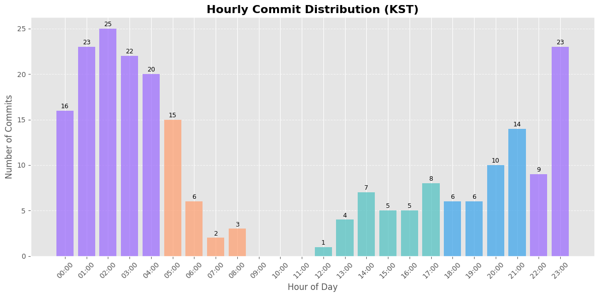

<!--START_SECTION:waka-->
**I'm a Night 🦉** 

```text
🌞 Morning                332 commits         █░░░░░░░░░░░░░░░░░░░░░░░░   04.27 % 
🌆 Daytime                1441 commits        █████░░░░░░░░░░░░░░░░░░░░   18.54 % 
🌃 Evening                3070 commits        ██████████░░░░░░░░░░░░░░░   39.49 % 
🌙 Night                  2931 commits        █████████░░░░░░░░░░░░░░░░   37.70 % 
```
📅 **I'm Most Productive on Tuesday** 

```text
Monday                   1234 commits        ████░░░░░░░░░░░░░░░░░░░░░   15.87 % 
Tuesday                  1401 commits        █████░░░░░░░░░░░░░░░░░░░░   18.02 % 
Wednesday                1279 commits        ████░░░░░░░░░░░░░░░░░░░░░   16.45 % 
Thursday                 900 commits         ███░░░░░░░░░░░░░░░░░░░░░░   11.58 % 
Friday                   1053 commits        ███░░░░░░░░░░░░░░░░░░░░░░   13.55 % 
Saturday                 746 commits         ██░░░░░░░░░░░░░░░░░░░░░░░   09.60 % 
Sunday                   1161 commits        ████░░░░░░░░░░░░░░░░░░░░░   14.93 % 
```


📊 **This Week I Spent My Time On** 

```text
💬 Programming Languages: 
JavaScript               7 hrs 32 mins       ██████████████░░░░░░░░░░░   54.08 % 
TypeScript               5 hrs 39 mins       ██████████░░░░░░░░░░░░░░░   40.61 % 
Go                       26 mins             █░░░░░░░░░░░░░░░░░░░░░░░░   03.11 % 
Markdown                 6 mins              ░░░░░░░░░░░░░░░░░░░░░░░░░   00.78 % 
TSConfig                 3 mins              ░░░░░░░░░░░░░░░░░░░░░░░░░   00.43 % 

🔥 Editors: 
VS Code                  7 hrs 47 mins       ██████████████░░░░░░░░░░░   55.87 % 
WebStorm                 5 hrs 41 mins       ██████████░░░░░░░░░░░░░░░   40.79 % 
GoLand                   27 mins             █░░░░░░░░░░░░░░░░░░░░░░░░   03.34 % 

🐱‍💻 Projects: 
algorithm-study          7 hrs 7 mins        █████████████░░░░░░░░░░░░   51.09 % 
untitled                 3 hrs 8 mins        ██████░░░░░░░░░░░░░░░░░░░   22.49 % 
piper-trail              2 hrs 43 mins       █████░░░░░░░░░░░░░░░░░░░░   19.55 % 
dBtree                   27 mins             █░░░░░░░░░░░░░░░░░░░░░░░░   03.34 % 
JumpToAlgorithm          25 mins             █░░░░░░░░░░░░░░░░░░░░░░░░   03.03 % 
```


 Last Updated on 20/05/2025 15:16:44 UTC
<!--END_SECTION:waka-->

<!-- HOURLY-COMMIT-GRAPH:START -->

<!-- HOURLY-COMMIT-GRAPH:END -->